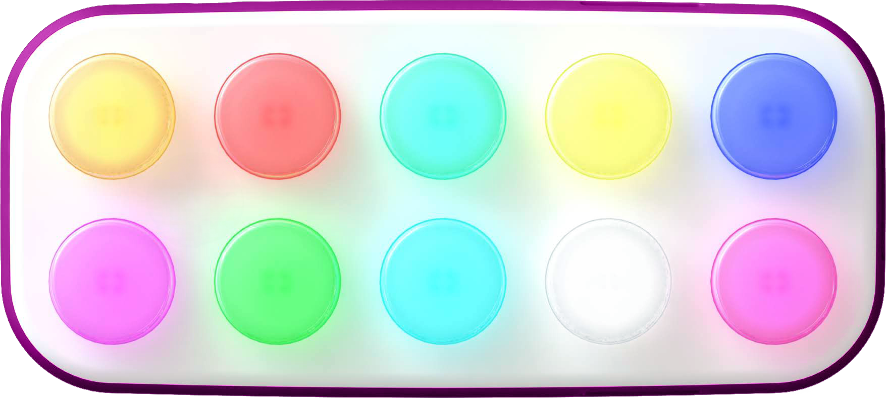

[boppo] is a tablet with 10 light up buttons and a speaker but no screen. I have
been working on it for over 4 years.

I have developed over 30 activities at this time but I am most excited to see
what activities others will build for the tablet.

We are making an open source SDK for activity development which will be released
before the tablet ships.

## The Specifications (subject to change)

boppo's 10 light up buttons contain an RGB LED that can be changed to any RGB
value but bright and saturated colors are best represented (e.g. black is just
off and does not look black).

The buttons are quality mechanical keyboard switches (currently Gateron Green
switches).

boppo is powered by an [ESP32-S3] which is a microcontroller that has:

* a dual-core CPU running at 240 Mhz
* 512 kB SRAM
* At least 2 MB PSRAM
* Wifi and Bluetooth communication

boppo also has:

* a 3.5 Watt (max) speaker
* an NFC antenna that can read supported NFC tags
* a rechargable lipo battery
* a USB-C port (for recharging and potential data transfer such as firmware flashing)

# The SDK API

The current activities and API are programmed in the  [Rust] programming
language. Additional language integration is possible in the future.

Easy to use functions and structs for receiving input and changing the button
colors are provided.

I also developed a custom audio playback library called [awedio] to support
streaming multiple sounds with effects simultaneously on an ESP-32 which is used
in the SDK.

## Share with Others

Made an activity that you think others will like? Let us know and we will
consider including it in the global list shipped to all devices.

## Security

The device does not have any microphones or cameras and does not collect
sensitive user information.

boppo source code is manually verified before being deployed to tablets. Since
ESP-32 runs a minimal embedded OS, no untrusted 3rd party code is allowed to run
(unlike Android/iOS).

## Open

The circuit board schematic will be available to the public. The  [awedio] audio
playback library has been open sourced and the SDK will be open sourced in the
future. I plan to open source more of the platform over time.

## Questions or Comments?

Check out our [FAQ], post a question in our [reddit thread] or email me at
ben@boppo.com

[boppo]: https://boppo.com
[Rust]: https://rust-lang.org
[awedio]: https://github.com/10buttons/awedio
[ESP32-S3]: https://www.espressif.com/en/products/socs/esp32-s3
[FAQ]: https://boppo.com/pages/faq
[reddit thread]: https://www.reddit.com/r/boppo/comments/1eqmc9v/got_a_question_ask_here/
